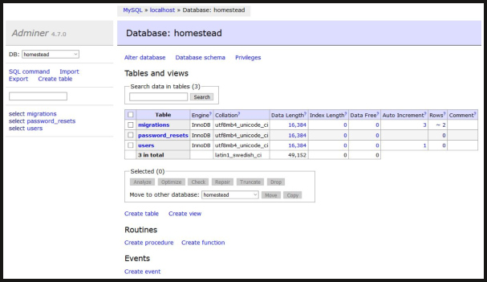
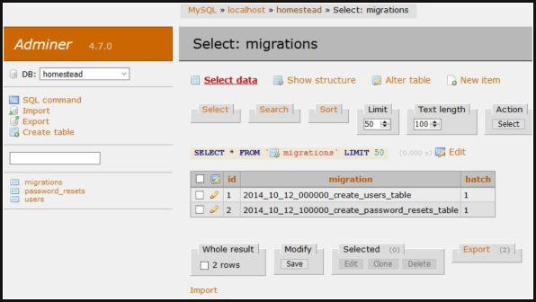
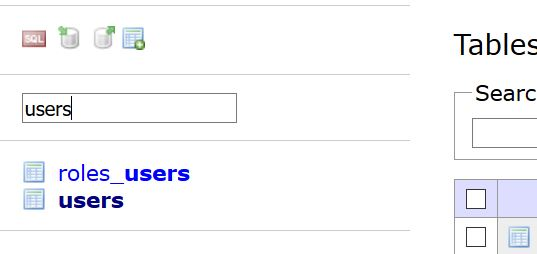

<p align="center">
<a href="https://packagist.org/packages/aranyasen/laravel-adminer"></a>
<a href="https://packagist.org/packages/aranyasen/laravel-adminer"></a>
<a href="https://packagist.org/packages/aranyasen/laravel-adminer"></a>
</p>

# Introduction
Laravel 5 wrapper for [Adminer](https://www.adminer.org).
Adminer is a fast single-file database manager/explorer tool written by Jakub Vrana. It's a great replacement for 
PhpMyAdmin (also supports PostgreSQL, SQLite, MS SQL, Oracle, Firebird, SimpleDB, Elasticsearch and MongoDB).

This package is meant to be used with Laravel as an in-built database manager/explorer. It comes with support for
Adminer [plugins](https://www.adminer.org/en/plugins/) and themes, which super-charges an already powerful tool.

This package is inspired by: [miroc/Laravel-Adminer](https://github.com/miroc/Laravel-Adminer). The reason to add this
 package is to keep it up-to-date with Adminer, add plugin support and a test suite (TBD).
 
 #### Database view with default theme
 


#### Table view with 'rmsoft' theme



## Plugins Included

#### Tables-filter

Adds ability to do (fuzzy) search on table names. It's especially useful when you have a large set of tables 



## Installation
To use this package, run:
```
composer require aranyasen/laravel-adminer
```
### To use Adminer to Laravel routes (e.g. /adminer), update `routes/web.php`:

To autologin Adminer with Laravel default connection:
```php
Route::any('adminer', '\Aranyasen\LaravelAdminer\AdminerAutologinController@index');
```

If you want to manually provide credentials on the UI instead:
```php
Route::any('adminer', '\Aranyasen\LaravelAdminer\AdminerController@index');
```

Of course, you can add any middleware of your choice to restrict usage:
```php
Route::any('adminer', '\Aranyasen\LaravelAdminer\AdminerAutologinController@index')
    ->middleware(['admin']);
```

### Disabling CSRF Middleware
Adminer doesn't work with VerifyCsrfToken middleware, so it has to be disabled on its route.
In `VerifyCsrfToken.php` disable CSRF by adding adminer route to `$except` array:
```php
protected $except = [
    'adminer'
];
```

### To add plugins
Adminer supports a host of [plugins](https://www.adminer.org/en/plugins/). 
See [CONTRIBUTING](CONTRIBUTING.md) to add a new plugin

### To add a new theme:
Download your favorite theme in `public/`, e.g.:
```bash
$ wget https://raw.githubusercontent.com/vrana/adminer/master/designs/hever/adminer.css
```
